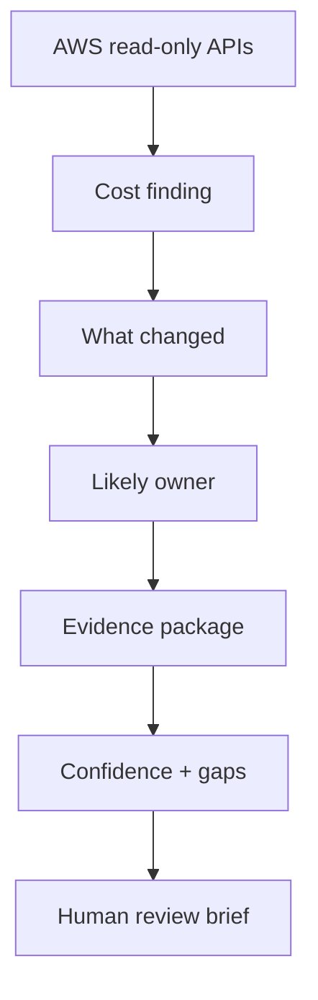

# Kulshan MVP v2

## Cloud Cost Investigation

Kulshan exists to reduce MTTE: Mean Time To Explanation.

MTTE is the time between:

```text
"EC2 is up 30%. What happened?"
```

and:

```text
"Here is the most defensible explanation, the evidence behind it, the likely owner, and what still needs human review."
```

The next 60 days should focus on one customer workflow:

> Help a FinOps practitioner or platform engineer explain a cloud cost increase before the meeting starts.

---

## The First User

It is Monday afternoon.

Finance sends a Slack message:

> EC2 is up 30% this month. What happened?

The person receiving it is a FinOps practitioner or platform engineer.

They have Cost Explorer open.

They have tags that are incomplete.

They have account names, service movement, maybe CloudTrail, and maybe some team conventions.

They do not have a confident explanation.

They do not know whether this is waste, a workload launch, an ownership issue, or a billing artifact.

They have a meeting at 3 PM.

They need a defensible brief before the meeting starts.

---

## Why Cost Investigations Are Slow

Cloud cost investigations are slow because the answer is spread across disconnected evidence.

```text
Cost Explorer
  |
  v
Account names
  |
  v
Tags
  |
  v
Resource names
  |
  v
IAM / CloudTrail hints
  |
  v
Human memory
```

The painful part is not seeing that EC2 increased.

The painful part is answering:

* What changed?
* Who likely owns it?
* What evidence supports that theory?
* What evidence does not fit?
* What is missing?
* What should be reviewed first?

---

## The Painful Workflow

```text
Cost spike
  |
  v
Finance asks what happened
  |
  v
Someone opens Cost Explorer
  |
  v
Tags are incomplete
  |
  v
Owner is unclear
  |
  v
Several people guess in Slack
  |
  v
Meeting starts without a defensible explanation
```

This is the workflow Kulshan should improve.

---

## The Kulshan Workflow

```text
Cost spike
  |
  v
Kulshan identifies what changed
  |
  v
Kulshan proposes the likely owner
  |
  v
Kulshan attaches supporting evidence
  |
  v
Kulshan shows contradicting and missing evidence
  |
  v
Kulshan scores confidence
  |
  v
Human reviews a Slack-ready brief
```

Kulshan should be an evidence investigator, not a cost narrator.

---

## The Wedge

Ownership and evidence triage.

```text
Cost anomaly / finding
        |
        v
What changed?
        |
        v
Who likely owns it?
        |
        v
What evidence proves it?
        |
        v
What evidence weakens it?
        |
        v
What should be reviewed first?
        |
        v
Slack-ready brief
```

---

## Product Principle

Every MVP decision should pass this test:

> Does this help someone answer what happened before the meeting starts?

If the answer is no, it is not part of the next 60 days.

---

## First Build

Do not start with chat.

Do not start with MCP.

Do not start with memory.

Do not start with integrations.

Start with cloud cost investigation:



The first useful output is a brief a human can paste into Slack before the meeting.

---

## Evidence Contract

Every finding should produce the same investigation package.

```text
Finding:
EC2 spend increased 30% month over month

Business Impact:
+$3,420 month over month

Claim:
Increase is likely tied to a new production workload

Supporting Evidence:
- EC2 spend increased in the production account
- New tagged resources appeared during the period
- Resource names match platform naming conventions
- Account activity increased during the same window

Contradicting Evidence:
- No matching change ticket found
- Some increased spend is untagged

Missing Evidence:
- Deployment record
- Confirmed service owner
- Utilization data

Likely Owner:
Platform Team

Confidence:
Medium-high, because account and resource evidence agree, but change history is missing

Recommended Next Step:
Ask Platform Team to confirm whether a production workload launched during the billing period
```

This contract matters because it keeps Kulshan honest.

It shows what supports the explanation, what weakens it, and what still requires human review.

---

## Core Capabilities

Only build capabilities that reduce MTTE.

| Capability | Why it matters before 3 PM |
|---|---|
| Cost change detection | Shows what moved. |
| Ownership resolution | Identifies who to ask. |
| Claim-evidence mapping | Separates evidence from opinion. |
| Contradicting evidence | Prevents overconfident explanations. |
| Missing evidence detection | Shows what cannot be proven yet. |
| Confidence explanation | Explains why the answer is strong or weak. |
| Review brief generation | Turns investigation into usable communication. |

---

## Brief Shape

The brief should be short enough to paste into Slack.

```text
EC2 increased 30% month over month (+$3,420).

Most likely explanation:
New production workload.

Likely owner:
Platform Team.

Evidence:
- Increase concentrated in production account
- New EC2 resources appeared during the period
- Resource names match platform conventions

What does not fit:
- No matching change ticket found
- Some spend is untagged

Confidence:
Medium-high.

Recommended next step:
Ask Platform Team to confirm whether a production workload launched.
```

This is the product moment.

---

## Human Review

Kulshan does not make the decision.

Kulshan reduces the time required to produce a defensible explanation.

Humans still confirm ownership, business intent, and next action.

---

## Not In The Next 60 Days

These may matter later, but they do not help the first user answer the Monday question faster.

| Not now | Reason |
|---|---|
| Organizational memory | Useful later, not required for first MTTE reduction. |
| Decision infrastructure | Too broad for the current workflow. |
| Agent ecosystem | The brief matters before the ecosystem. |
| MCP server | Useful after the evidence package is trusted. |
| Graph database | Premature until the evidence contract works. |
| Multi-cloud | AWS-only keeps the investigation sharper. |
| Auto-created Jira tickets | Risk of creating noise before trust. |
| Broad platform narrative | Does not change what gets built next. |

---

## Product Rule

Help cloud teams answer 'what happened?' before the meeting starts.
